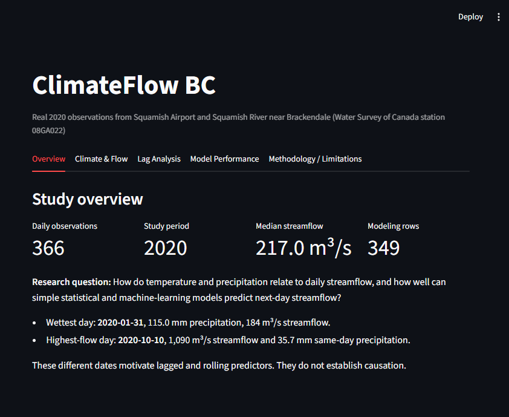
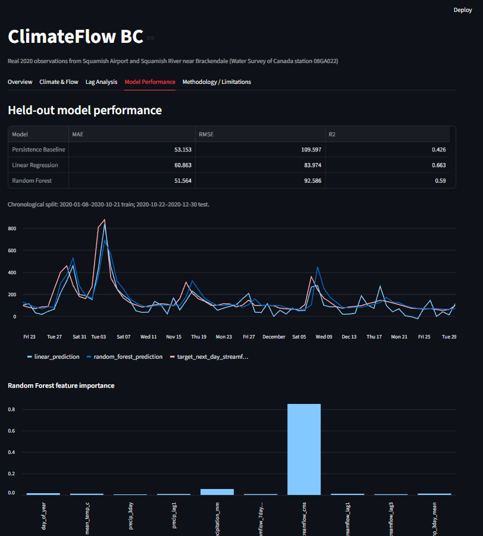

# ClimateFlow BC

An end-to-end environmental data science project using **real 2020 observations from Squamish, British Columbia** to examine hydroclimate patterns and compare simple next-day streamflow prediction methods.

> Built by a UBC Statistics and Environmental Science student. This is a retrospective portfolio analysis, not an operational flood forecasting system.

[Live Streamlit Dashboard](https://j7wndxxdfa8vc8dvc3ufgj.streamlit.app/) · [GitHub Repository](https://github.com/adit-hossain/ClimateFlow-BC)

## At a glance

| | |
|---|---|
| **Climate data** | Environment and Climate Change Canada, Squamish Airport |
| **Streamflow data** | Water Survey of Canada, Squamish River near Brackendale (`08GA022`) |
| **Study period** | 366 merged daily observations from 2020 |
| **Modeling data** | 349 complete observations after feature engineering |
| **Validation** | Chronological 80/20 split; no random shuffling |
| **Models** | Persistence baseline, Linear Regression, Random Forest |

**Research question:** How do temperature and precipitation relate to daily streamflow, and how well can simple statistical and machine-learning models predict next-day streamflow?

## Results

The three approaches were evaluated on the final 70 dates, from October 22 to December 30, 2020.

| Model | MAE (m³/s) | RMSE (m³/s) | R² |
|---|---:|---:|---:|
| Persistence baseline | 53.153 | 109.597 | 0.426 |
| Linear Regression | 60.863 | **83.974** | **0.663** |
| Random Forest | **51.564** | 92.586 | 0.590 |

- **Random Forest had the lowest MAE**, indicating the smallest typical absolute error.
- **Linear Regression had the best RMSE and R²**, indicating fewer large errors and the strongest held-out variance explanation.
- No model is universally best: the preferred model depends on whether typical error or larger misses matter more.
- Current streamflow dominated Random Forest feature importance because next-day river discharge exhibits strong temporal persistence. Importance reflects predictive usefulness, not causation.





## Why lagged features?

The wettest day and highest-flow day did not coincide:

- January 31: 115 mm precipitation and 184 m³/s streamflow
- October 10: 1,090 m³/s streamflow and 35.7 mm same-day precipitation

This descriptive result suggests that same-day precipitation alone is insufficient for prediction. The project therefore includes recent precipitation totals, temperature averages, prior streamflow, and seasonal variables. It does not claim that these variables cause the observed flow patterns.

## Methodology

```text
Official data -> cleaning -> date-based merge -> EDA -> feature engineering
              -> chronological modeling -> Streamlit dashboard
```

1. Clean official climate and hydrometric downloads into documented schemas.
2. Join daily observations by date.
3. Interpolate only short internal climate gaps of up to three days; streamflow is not interpolated.
4. Create lagged, rolling, and seasonal predictors plus a next-day target.
5. Train on the first 80% of dates and test on the final 20% without shuffling.
6. Compare all learned models against the persistence rule: tomorrow's flow is approximately today's flow.

All predictors are available by the end of the forecast date. Tomorrow's streamflow appears only in the target column. The prior seven-day flow mean is shifted before rolling to prevent future information from entering the feature.

## Limitations

- One year does not represent year-to-year hydroclimate variability.
- The test set covers late autumn and winter rather than every season.
- Squamish Airport may not represent conditions across the full watershed.
- Snowpack, soil moisture, elevation, and possible river regulation are omitted.
- Rare high-flow events are difficult to estimate from a small sample.
- Retrospective linear interpolation would need a past-only alternative in a live workflow.

## Repository guide

| Path | Purpose |
|---|---|
| [`notebooks/`](notebooks/) | Cleaning, EDA, feature engineering, and modeling narrative |
| [`src/`](src/) | Reusable cleaning, merge, feature, and modeling scripts |
| [`dashboard/app.py`](dashboard/app.py) | Streamlit dashboard |
| [`data/processed/`](data/processed/) | Clean, merged, and modeling-ready datasets |
| [`outputs/`](outputs/) | Metrics, held-out predictions, and figures |
| [`docs/DATA_DICTIONARY.md`](docs/DATA_DICTIONARY.md) | Variable definitions and timing |
| [`docs/RECRUITER_DEMO.md`](docs/RECRUITER_DEMO.md) | Short project walkthrough and interview notes |
| [`tests/`](tests/) | Lightweight feature and chronology checks |

## Run locally

From the repository root on Windows PowerShell:

```powershell
python -m venv .venv
.venv\Scripts\Activate.ps1
python -m pip install -r requirements.txt
python src/run_all.py
python -m unittest discover -s tests -v
streamlit run dashboard/app.py
```

On macOS or Linux, replace the activation command with:

```bash
source .venv/bin/activate
```

`src/run_all.py` starts from the included real processed clean files. It does not download or generate replacement data.
